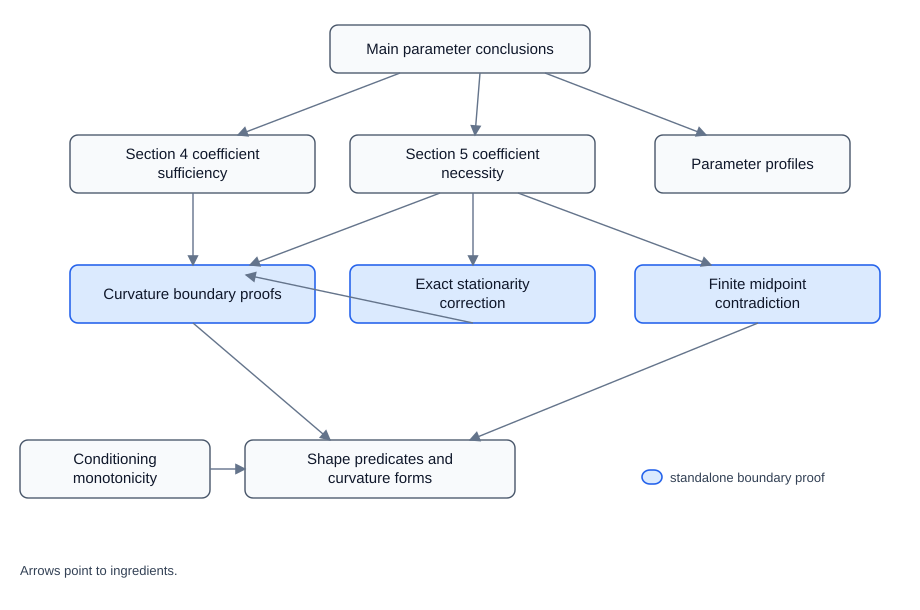

# A complete characterization of conditional entropies

This repository accompanies Sections 4 and 5 of the manuscript and records
their present Lean 4 formalization status. It contains machine-checked finite
algebraic, order-theoretic, stationarity, midpoint, dominant-block, and
pointwise-limit kernels, together with an exhaustive manuscript-to-Lean
coverage ledger and a LaTeX appendix for the paper.

> **This is not yet a Lean proof of the complete classification.** The genuine
> manuscript targets `necessityBundle`, `mainClassification`, and
> `allConditionalEntropyAxioms` are deliberately **not declared**. The
> supporting targets `ConditionalEntropyAxioms` and `embeddingLift` are also
> absent. Completing them requires formalization of the endpoint-aware Rényi
> parameter and integrals, real-power differentiation, signed-measure
> differentiation and discretization, the full two-block, three-block, and
> Shannon localization arguments, and the original semiring/channel lift.
> None of those missing steps is replaced by an axiom or by an assumed final
> theorem.

## What is in the repository

- [`CompleteCharacterization.lean`](CompleteCharacterization.lean) is the
  checked project entry point. Despite its filename, it imports the currently
  advertised checked modules; it does not assert the complete classification.
- [`ConditionalEntropy/Cone.lean`](ConditionalEntropy/Cone.lean) gives the
  proof-carrying nonnegative cone and checked translations of the first four
  Section 4 lemmas.
- [`BoundaryProofs/VerifiedKernelBundle.lean`](BoundaryProofs/VerifiedKernelBundle.lean)
  declares `ConditionalEntropy.verifiedKernelBundle`, a closed conjunction of
  the independently checked boundary kernels. Its conjuncts universally
  quantify their mathematical data and premises, so the bundle is evidence for
  those implications, not a hypothesis-free classification theorem.
- [`paper/BLUEPRINT_STATEMENT_STATUS.md`](paper/BLUEPRINT_STATEMENT_STATUS.md)
  is the exhaustive 152-row correspondence table with the columns
  **Manuscript statement**, **Lean declaration**, and **Status**. The matching
  LaTeX table is
  [`paper/blueprint-statement-correspondence.tex`](paper/blueprint-statement-correspondence.tex).
- [`paper/dependency-graph.svg`](paper/dependency-graph.svg) is the condensed
  dependency graph. Its editable source and PNG rendering are
  [`paper/dependency-graph.dot`](paper/dependency-graph.dot) and
  [`paper/dependency-graph.png`](paper/dependency-graph.png). A layer guide is
  in [`DEPENDENCIES.md`](DEPENDENCIES.md), and exact checked
  declaration-to-declaration edges are in
  [`paper/DECLARATION_INDEX.md`](paper/DECLARATION_INDEX.md).
- [`paper/lean-formalization-appendix.tex`](paper/lean-formalization-appendix.tex)
  is the paper appendix containing the scope statement, dependency graph, and
  three-column correspondence table.
  [`paper/main-with-lean-appendix.tex`](paper/main-with-lean-appendix.tex) is the
  main-paper wrapper that includes that appendix, while
  [`paper/lean-correspondence-standalone.tex`](paper/lean-correspondence-standalone.tex)
  is a bibliography-independent appendix wrapper. The full-paper wrapper
  retains the supplied manuscript's external bibliography references.
- [`paper/blueprint-sections-4-5.tex`](paper/blueprint-sections-4-5.tex) is a
  verbatim repository copy of the supplied self-contained blueprint used for
  the source-ordered audit.



## How to read a correspondence row

The table distinguishes a checked statement from a checked kernel.
`Proved and kernel checked` means that the listed Lean declaration has the
blueprint statement's full conclusion. `Partial algebraic kernel` means that
the listed declaration proves a genuine
finite calculation or logical implication used by the manuscript statement,
but not the statement's full measure-theoretic, asymptotic, or channel-level
conclusion. `Not formalized` means that no current project declaration is a
semantically justified Lean version of that statement. An entry in the Lean
column therefore must not be read as a claim that the entire manuscript row is
proved.

For example, the declarations in
[`ConditionalEntropy/MainTheorem.lean`](ConditionalEntropy/MainTheorem.lean)
assemble finite-profile consequences under explicit mathematical premises.
They are useful checked lemmas, but they are not `necessityBundle` or
`mainClassification`. The remaining analytic obligations are summarized in
[`FORMALIZATION_STATUS.md`](FORMALIZATION_STATUS.md), with the module-layer
plan in [`DEPENDENCIES.md`](DEPENDENCIES.md).

## Reproduce the checks

The project is pinned to **Lean 4.32.2** by
[`lean-toolchain`](lean-toolchain) and **Mathlib 4.32.2** by
[`lakefile.toml`](lakefile.toml).

On Windows, run from the repository root:

```powershell
powershell -File scripts/check.ps1
```

The script scans project Lean sources for `sorry`, `admit`, project-defined
`axiom`, and project-defined `opaque`; builds `CompleteCharacterization` with
warnings treated as errors; and runs the kernel dependency audit in
[`scripts/AxiomAudit.lean`](scripts/AxiomAudit.lean). The checked source
contains none of those four project-level escape hatches. Standard Lean and
Mathlib logical dependencies reported by `#print axioms` are part of the
trusted foundation, not project-specific axioms.

## Lean source map

- `ConditionalEntropy/Cone.lean`: proof-carrying nonnegative cone and four
  fully translated elementary Section 4 lemmas.
- `ConditionalEntropy/Basic.lean`: shape predicates and curvature forms.
- `ConditionalEntropy/Conditioning.lean`: finite row-stochastic conditioning
  reductions.
- `ConditionalEntropy/ParameterConditions.lean`: abstract finite profiles for
  moments and support data not yet produced by the missing analytic layer.
- `ConditionalEntropy/Sufficient.lean` and
  `ConditionalEntropy/Necessary.lean`: checked coefficient implications and
  scalar obstructions.
- `ConditionalEntropy/MainTheorem.lean`: partial finite-profile assembly.
- `BoundaryProofs/Curvature.lean`, `Stationarity.lean`, `Midpoint.lean`,
  `DominantBlock.lean`, and `PointwiseLimits.lean`: independently checked
  boundary kernels.

## License

Apache License 2.0; see [LICENSE](LICENSE).
