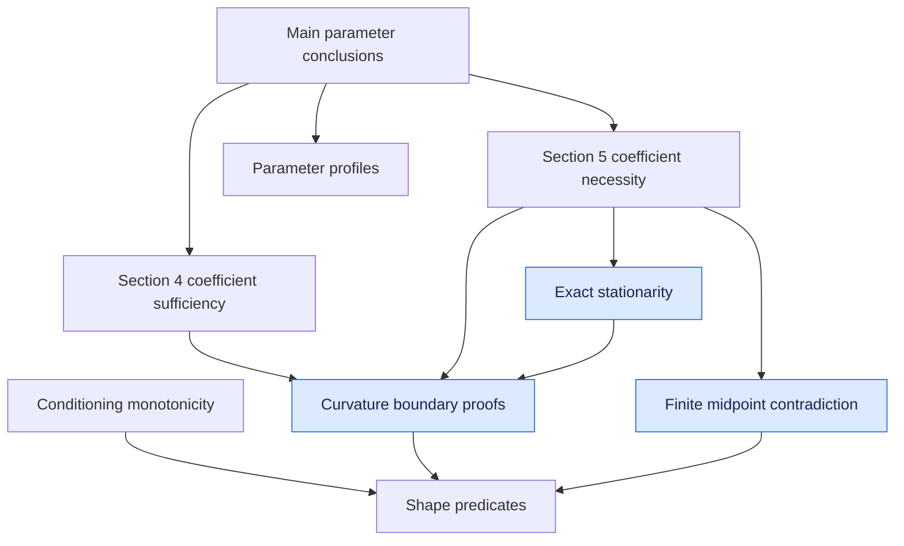

# Necessary and sufficient conditions for conditional entropies

[](https://github.com/robertorubboli/conditional-entropy-characterisation/actions/workflows/ci.yml)

Lean 4 formalization accompanying the rewritten Sections 4 and 5 of
[A complete characterisation of conditional entropies](https://arxiv.org/abs/2601.23213).
The project follows the dependency-ordered organization and paper-to-Lean
correspondence style of Appendix A of
[Weak Log-Majorization for Negative Lim-Pálfia Power Means](https://arxiv.org/abs/2608.08850).

The checked development covers:

- the Appendix A reduction from one-column concavity/convexity and positive
  homogeneity to monotonicity under row-stochastic conditioning maps;
- the affine-monomial Hessian identity and its sign consequences;
- the two-positive-coefficient witnesses used in the temperate and tropical
  necessity arguments;
- the Shannon-atom, upper-tail, and lower-moment algebraic obstructions;
- the exact finite-dimensional stationarity correction from Lemma B.15;
- the finite midpoint contradictions used in Appendix B.6; and
- assembled paper-facing parameter conclusions at the finite coefficient
  profile level.

The repository contains no `sorry`, no `admit`, and no project-defined
`axiom`. `scripts/AxiomAudit.lean` prints the kernel dependencies of the public
declarations. See [FORMALIZATION_STATUS.md](FORMALIZATION_STATUS.md) for the
exact boundary between checked results and remaining analytic work.

## Build and audit

The project is pinned to Lean 4.32.2 and Mathlib 4.32.2.

```sh
lake update
lake exe cache get
lake build ConditionalEntropy BoundaryProofs --wfail
lake env lean scripts/AxiomAudit.lean
```

On Windows, `powershell -File scripts/check.ps1` runs the same checks. The
GitHub Actions workflow runs them on every push and pull request.

## Source layout

- `ConditionalEntropy/Basic.lean`: chord-shape predicates and curvature forms.
- `ConditionalEntropy/Conditioning.lean`: Appendix A conditioning-map reduction.
- `BoundaryProofs/Curvature.lean`: standalone coefficient curvature proofs.
- `BoundaryProofs/Stationarity.lean`: exact stationarity and convergence.
- `BoundaryProofs/Midpoint.lean`: finite midpoint counterexamples.
- `ConditionalEntropy/ParameterConditions.lean`: paper-facing parameter profiles.
- `ConditionalEntropy/Sufficient.lean`: Section 4 coefficient sufficiency.
- `ConditionalEntropy/Necessary.lean`: Section 5 coefficient necessity.
- `ConditionalEntropy/MainTheorem.lean`: public assembly declarations.
- `paper/lean-correspondence.tex`: LaTeX correspondence section.
- `paper/dependency-graph.dot`: source for the dependency graph.

## Dependency graph

Arrows point from a conclusion to its ingredients. Blue nodes are standalone
boundary proofs, matching the convention of the reference paper.



The rendered version is available as
[`paper/dependency-graph.svg`](paper/dependency-graph.svg).

## License

Apache License 2.0; see [LICENSE](LICENSE).
